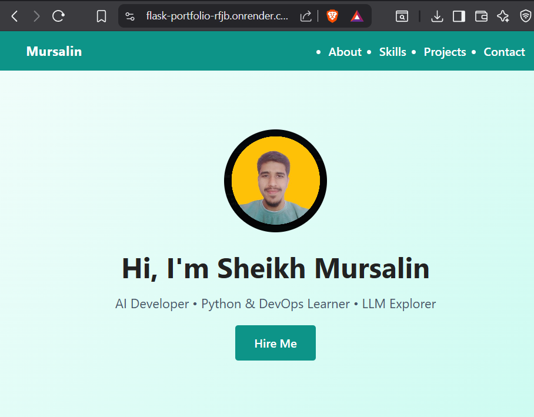

# 💼 Sheikh Mursalin — Portfolio Website (Flask)

Welcome to my personal portfolio website, built using **Flask**, **HTML**, **CSS**, and **JavaScript**.  
This project showcases my **skills**, **projects**, and provides an **enquiry form** to get in touch with me.

Live Deployment: [🔗 Render Link ](https://flask-portfolio-rfjb.onrender.com)

---

## 🚀 Features

- 🎯 Clean and responsive UI with modern layout
- 🧠 Skills section with key tech stacks: Python, Flask, ML, DevOps
- 🧪 Project showcase cards with live/code links
- 📧 Contact section with working enquiry form (AJAX-based)
- 🧭 Sidebar menu for mobile-friendly navigation
- 🔒 Lightweight and production-ready Flask backend

---

## 🖼️ Preview



---

## 📂 Folder Structure

```
flask-portfolio/
│
├── app.py                  # Flask backend
├── requirements.txt        # Python dependencies
├── templates/
│   └── index.html          # Main HTML page
├── static/
│   ├── css/
│   │   └── style.css       # Custom styling
│   ├── js/
│   │   └── script.js       # Sidebar & form scripts
│   └── images/             # (optional) Profile/Project images
├── Procfile                # Render deployment instruction
└── README.md
```

---

## 📦 Installation & Local Setup

### 🔧 Prerequisites

- Python 3.8+
- pip

### ⚙️ Setup Steps

```bash
# 1. Clone the repo
git clone https://github.com/sheikhmursalin/flask-portfolio.git
cd flask-portfolio

# 2. Create virtual environment
python -m venv venv
source venv/bin/activate        # macOS/Linux
.env\Scriptsctivate         # Windows

# 3. Install dependencies
pip install -r requirements.txt

# 4. Run Flask app
python app.py
```

Now open [http://localhost:5000](http://localhost:5000) to view the website.

---

## 🌐 Deployment (Render)

### ⚙️ Add these files/configs:

- ✅ `Procfile`:
  ```txt
  web: gunicorn app:app
  ```

- ✅ Set `Python` build environment and add this in `render.yaml` or web dashboard:
  ```
  START COMMAND: gunicorn app:app
  ```

- ✅ Add these environment variables if you use contact email via Flask-Mail.

---

## 👨‍💻 Technologies Used

| Frontend        | Backend     | Tools & Platforms |
|----------------|-------------|-------------------|
| HTML5, CSS3     | Python 3    | Git & GitHub      |
| JavaScript      | Flask       | Render            |
| Responsive Grid | Gunicorn    | LeetCode, Kaggle  |

---

## 📬 Contact

Feel free to connect or reach out:

- 📧 Email: [er.sheikh.mursalin@gmail.com](mailto:er.sheikh.mursalin@gmail.com)
- 💼 [LinkedIn](https://www.linkedin.com/in/sheikh-mursalin-bb4bb9227/)
- 🧠 [GitHub](https://github.com/sheikhmursalin)
- 🧠 [LeetCode](https://leetcode.com/u/Sheikh_Mursalin/)
- 🐦 [Twitter](https://x.com/Sheikh_Mursu)

---

## 📌 License

This project is open-source and available under the [MIT License](LICENSE).

---

> 💡 Tip: Feel free to fork and customize this template for your own portfolio!